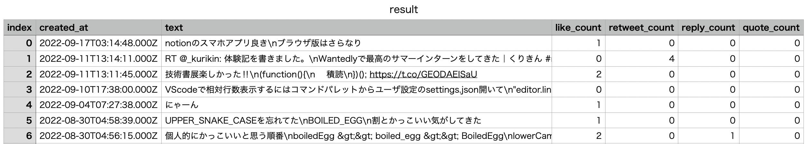

# TWITTER analyzer

Tremendous Wanderful Inteligent Technical Terrific Effective Readily analyzer

## Hello!!

Hi! Thank you for your visiting this repository. This repository are being made for getting a CSV file that has twitter infomation bellow by **JavaScript**.

1. tweet date
2. tweet content
3. how many likes the tweet got
4. how many retweets the tweet got
5. how many times the tweet were replied
6. how many times the tweet were quated

If you wanna get these information, this repository would defenitely help you.(100 tweets limitation)

## Result sample



## My environment

macOS Monterey 12.3.1

node 16.3.1

yarn 1.22.17

## Preperation

1. Download Node.js
2. Get bearer token by making twitter developer account
3. get userID by executing command bellow. [^1]

```
curl "https://api.twitter.com/2/users/by/username/{username}" -H "Authorization: Bearer $TWITTER_BEARER_TOKEN"
```

[^1]: you have to change {username} and $TWITTER_BEARER_TOKEN.

## Usage

1. Clone this repository and Install dependencies(ex. `yarn install `)
2. Change userID(get_tweets.js line4) or make environmental variable(MY_TWITTER_ID=) in your PC
3. Execute `node main.js`
4. That's it!! Now you get a CSV file named result.csv

## log

### 2022/09/17

There are a lot of improvements. The biggest problem is limitation that we could not get 101 or more tweets.

### 2022/09/18

Now that we don't have to use JSONtoCSV extension in VScode, all we have to do is just excecuting `node main.js > result.csv`.

### 2022/10/01

To use this program more easily, I add write_file.js. Now, we just excecute `node main.js`.
